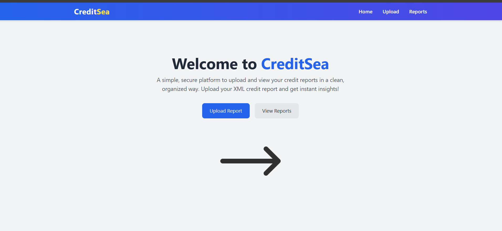
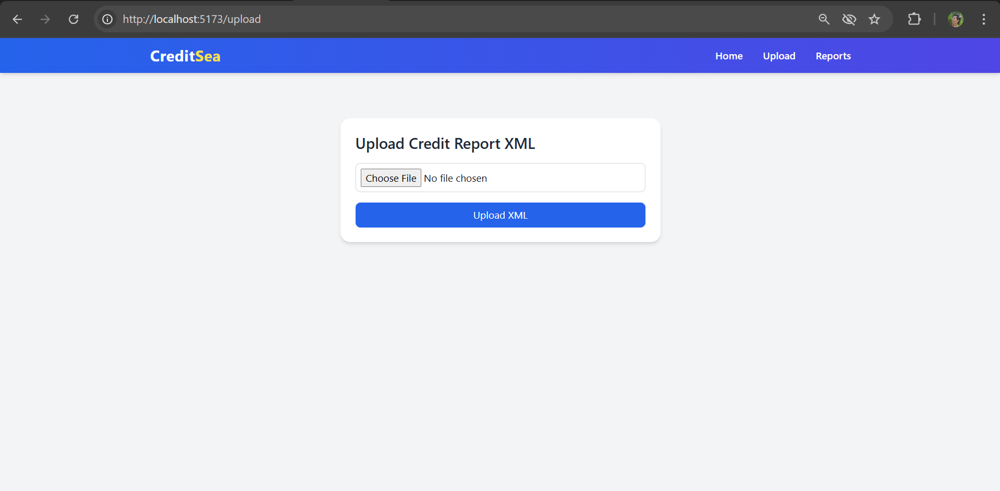
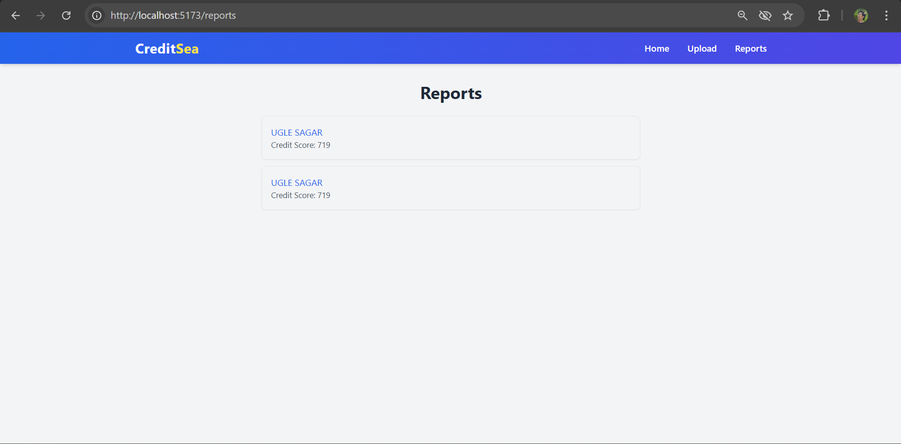
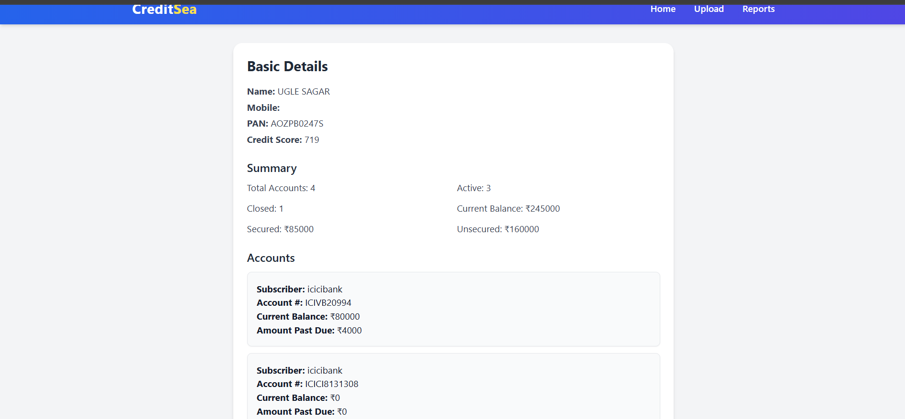

# CreditSea — MERN XML Credit Report Processor

**Author:** [Ishan Ahmad Siddiqui](mailto:ishansiddiqui011@gmail.com)  
**Linkedin:** [Linkdin](https://linkedin.com/in/ishan-ahmad-siddiqui)

---

## 🚀 Objective

Design and implement a **fullstack MERN application** (MongoDB, Express, React, Node.js) that processes **Experian XML files** containing soft credit pull data.

The application allows:
- Uploading XML files via an Express backend  
- Parsing & storing extracted credit details in MongoDB  
- Displaying detailed reports through a clean React (Vite + Tailwind) frontend interface  

---

## 📋 Project Overview

### 1. XML Upload Endpoint
- RESTful API (`POST /api/reports/upload`) built using Express & Node.js.
- Accepts XML file uploads with validation and error handling.
- Parses XML to extract relevant credit data.

### 2. Data Extraction & Persistence
Extracted fields include:

#### 🧾 Basic Details
- Name  
- Mobile Phone  
- PAN  
- Credit Score  

#### 📊 Report Summary
- Total Number of Accounts  
- Active Accounts  
- Closed Accounts  
- Current Balance Amount  
- Secured Accounts Amount  
- Unsecured Accounts Amount  
- Last 7 Days Credit Enquiries  

#### 💳 Credit Accounts Information
- Credit Cards  
- Banks of Credit Cards  
- Addresses  
- Account Numbers  
- Amount Overdue  
- Current Balance  

All data is stored in MongoDB using a well-structured schema.

### 3. Reporting Frontend
A **React + Vite + Tailwind** frontend:
- Fetches report data from backend.
- Displays details in clean, structured sections:
  - **Basic Details**
  - **Report Summary**
  - **Credit Accounts Information**

---

## ⚙️ Tech Stack

| Layer | Technology |
|--------|-------------|
| **Frontend** | React, Vite, Tailwind CSS |
| **Backend** | Node.js, Express |
| **Database** | MongoDB (Mongoose ODM) |
| **Parsing** | xml2js / fast-xml-parser |
| **Tools** | Axios, React Router DOM |

---
##  📸 Screenshots

---
